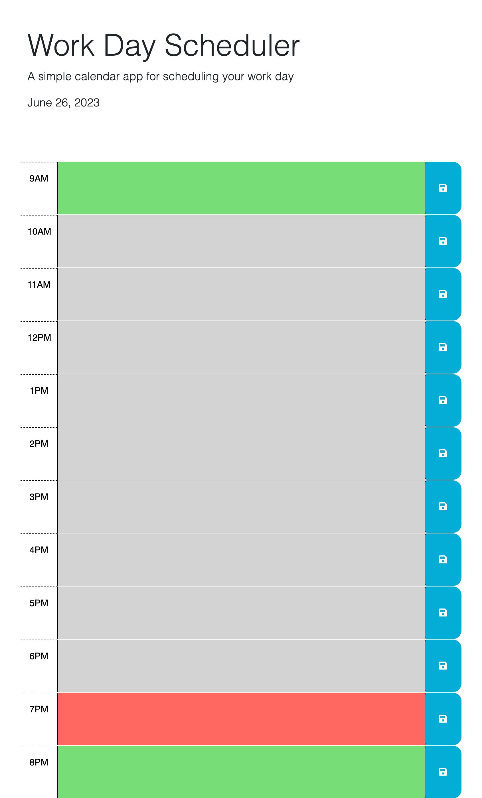

# Taja's Work Day Scheduler 

## Description

The motivation behind this project was the desire to make my days easier to manage by being able to look at my schedule at a glance. This project was created so that I would be able to create a schedule by inputing events into specifiic time slots and save said events to view at a later time, thus creating the schedule. The time slots are also color coded to correspond with 'past', 'present', and 'future' to reflect a full day. This project solves the problem of mismanaged time and I learned more about the concept of using id attributes to form conditional statements. 

## Installation

N/A

## Usage

Please click the following link to take you to the scheduler: http://127.0.0.1:5502/index.html

The page should look like the following:  

## Credits

N/A

## License 

MIT License

